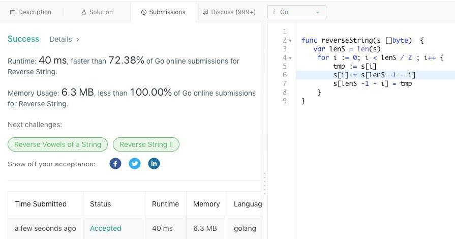
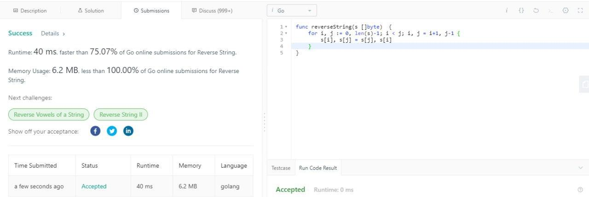
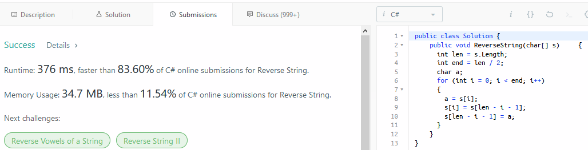
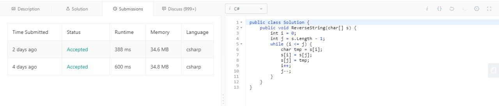
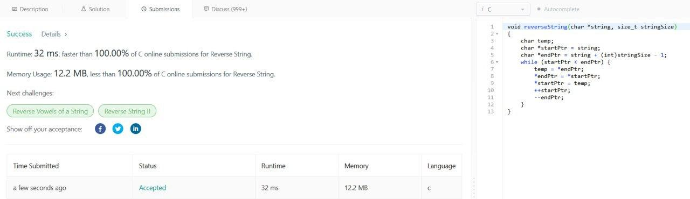
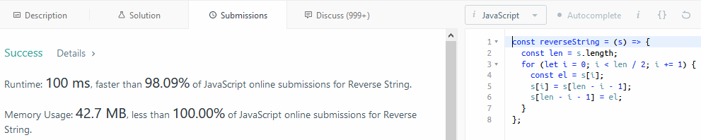

# Algo1

## Задача "Разворот строки"

[Ссылка на задачу](https://leetcode.com/problems/reverse-string/)

## Решение

```java
class Solution {
    public void reverseString(char[] s) {
        int left = 0, right = s.length - 1;
        while (left < right) {
            char tmp = s[left];
            s[left++] = s[right];
            s[right--] = tmp;
        }
    }
}
```

## Решения участников

### Go

#### @iBubnov



#### @vF1sher



### CSharp

#### @vvilliamblake



#### @vF1sher



### C

#### @vasssad



### JS

#### @vvilliamblake


