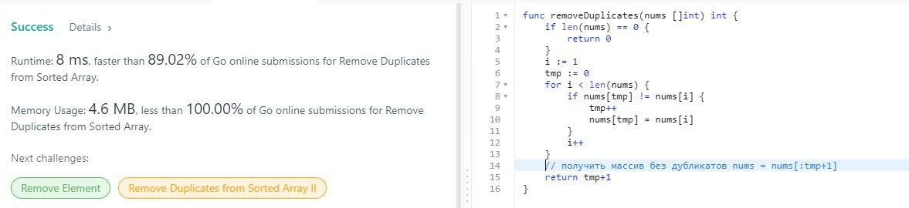
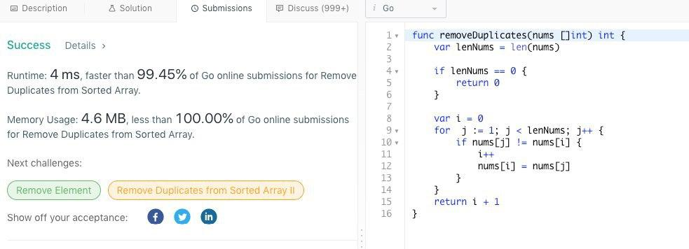
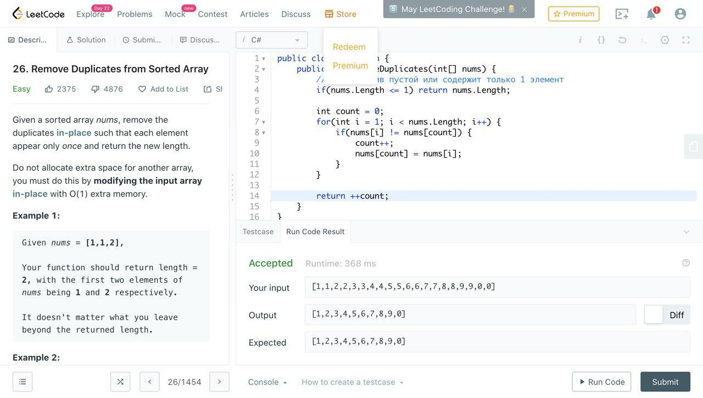
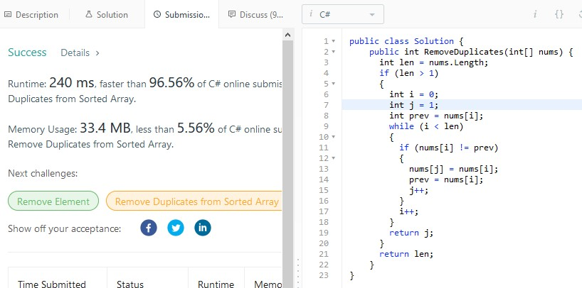
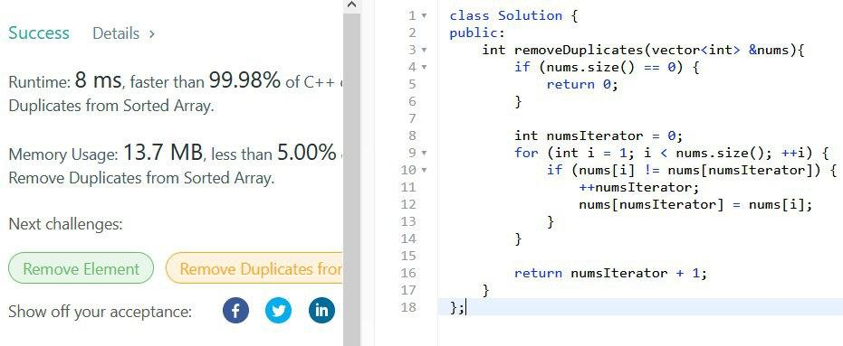

# Algo2

## Задача "Удаление дубликатов из отсортированного массива"

[Ссылка на задачу](https://leetcode.com/problems/remove-duplicates-from-sorted-array/)

## Решение

```java
public int removeDuplicates(int[] nums) {
    if (nums.length == 0) return 0;
    int i = 0;
    for (int j = 1; j < nums.length; j++) {
        if (nums[j] != nums[i]) {
            i++;
            nums[i] = nums[j];
        }
    }
    return i + 1;
}
```

## Решения участников

### Go





### CSharp





### C++


